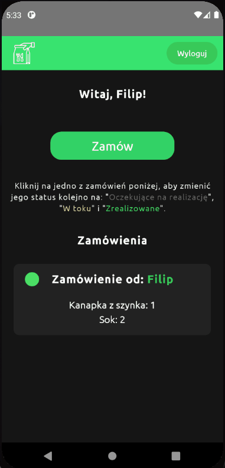

# Order This Order That

Small React Native app for Android I made during quarantine for isolated family members.
It provides an easy way to ask someone for prepearing a meal or other requests.
App has an option to change order's status too.

## Demo

## Installation
If you want to run it locally, you need to install an Android Studio or use Expo.
After setup, simply install all dependecies with `npm i` and run `npx react-native run-android`.
